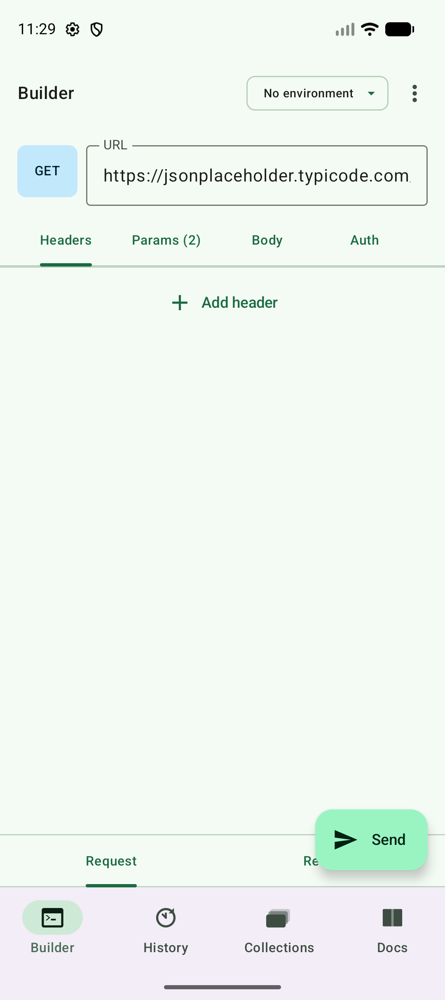
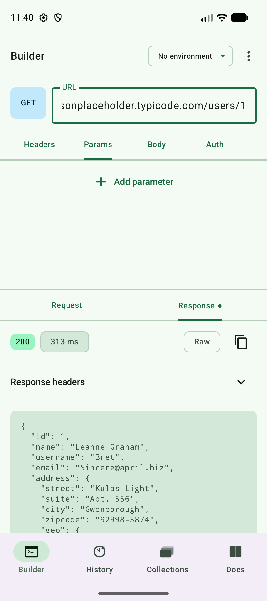
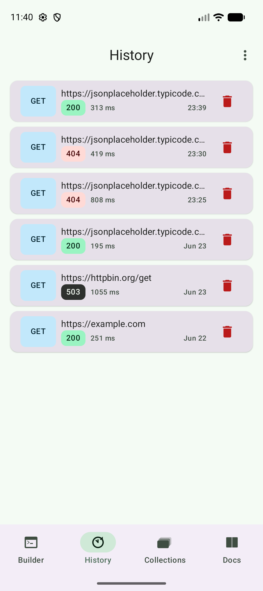
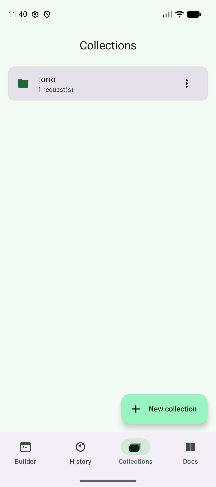
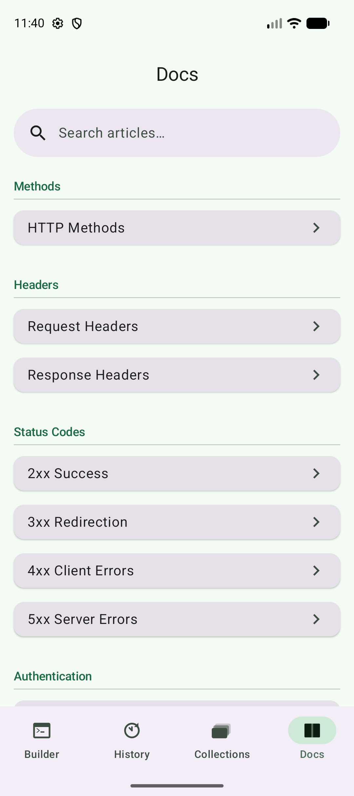

# RequestLab

A lightweight, offline-first HTTP client for Android — a "Postman-lite" you carry in your pocket. Build and send HTTP requests, organize them into collections, manage environments with token substitution, and review past responses, all from a clean Jetpack Compose interface.

## Screenshots

| Request Builder | Response Viewer | History |
|:---:|:---:|:---:|
|  |  |  |

| Collections | Docs |
|:---:|:---:|
|  |  |

## Features

- **Request Builder** — Compose requests with any HTTP method, headers, query params, body, and auth, then inspect the full response.
- **Collections** — Group related requests so they're easy to find and reuse.
- **Environments** — Define variables and inject them into requests via `{{token}}` substitution; switch environments without rewriting URLs.
- **History** — Every sent request is recorded for quick replay and review.
- **Docs** — Built-in reference articles bundled with the app.
- **Settings** — App-wide preferences persisted across launches.
- **Secure secrets** — Sensitive values are encrypted at rest using the Android Keystore (AES/GCM).

## Tech Stack

| Concern            | Choice                                            |
|--------------------|---------------------------------------------------|
| Language           | Kotlin (JVM 17)                                   |
| UI                 | Jetpack Compose + Material 3                       |
| Architecture       | MVVM, feature-based modules, `UiState` + events   |
| Dependency Injection | Hilt                                             |
| Persistence        | Room (with KSP) + DataStore (preferences)         |
| Networking         | OkHttp                                             |
| Serialization      | kotlinx.serialization (JSON)                       |
| Crypto             | Android Keystore (AES/GCM secret cipher)          |
| Build              | Gradle (Kotlin DSL) + version catalog             |

## Requirements

- **Android Studio** (latest stable recommended)
- **JDK 17**
- **Android SDK** — `compileSdk` / `targetSdk` **36**, `minSdk` **26**

> `minSdk 26` is required for Keystore AES/GCM, `java.time`, and SAF persistable URI permissions.

## Project Structure

```
app/src/main/java/eu/mihaibadea/requestlab/
├── core/                 # Cross-cutting infrastructure
│   ├── common/           # Result/error model, dispatchers, connectivity
│   ├── crypto/           # Keystore-backed secret cipher
│   ├── database/         # Room database, DAOs, type converters
│   ├── datastore/        # Preferences storage
│   ├── designsystem/     # Theme, tokens, reusable components
│   ├── navigation/       # NavHost + destinations
│   └── network/          # HttpEngine (OkHttp) + DI
└── feature/              # Feature modules
    ├── builder/          # Request builder & response viewer
    ├── collections/      # Saved request collections
    ├── docs/             # In-app documentation
    ├── environments/     # Environments & token substitution
    ├── history/          # Request history
    └── settings/         # App settings
```

## Getting Started

```bash
# Clone
git clone https://github.com/bmbogdan/request-lab.git
cd request-lab

# Build a debug APK
./gradlew assembleDebug

# Install on a connected device/emulator
./gradlew installDebug
```

Or open the project in Android Studio and run the **app** configuration.

## Testing

```bash
# Unit tests (ViewModels, repositories, use cases)
./gradlew test

# Instrumented tests (requires a connected device/emulator)
./gradlew connectedAndroidTest
```

## License

This project does not yet declare a license. Add one before distributing.
